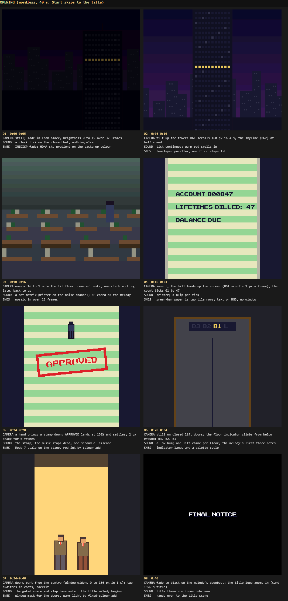
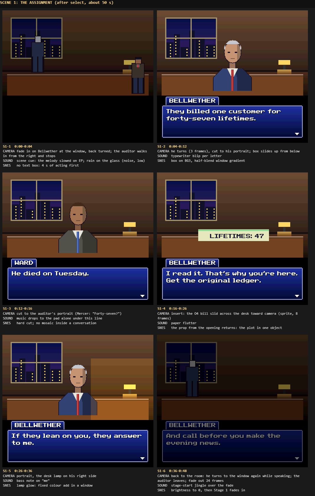
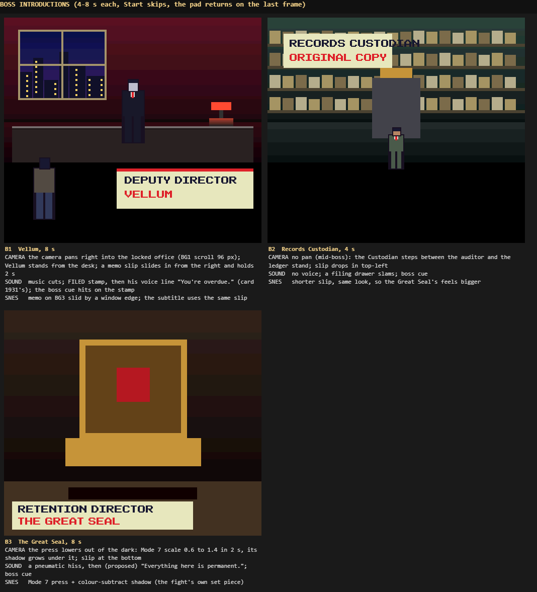
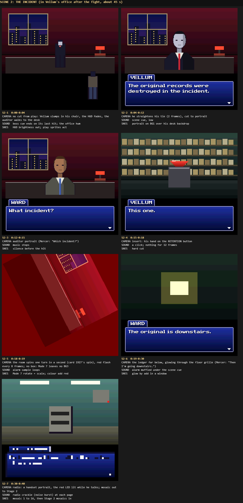
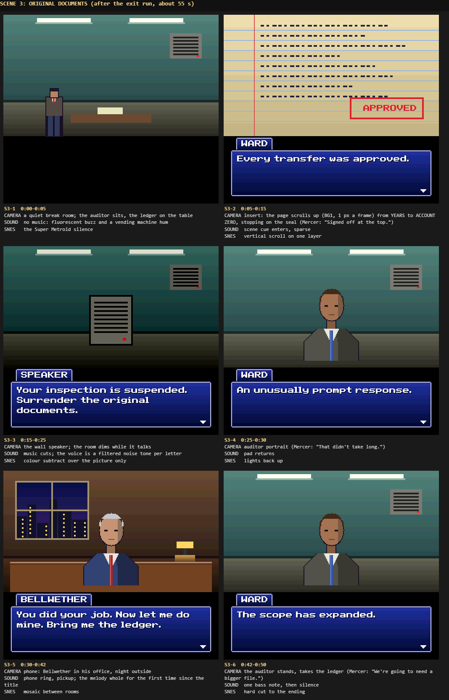
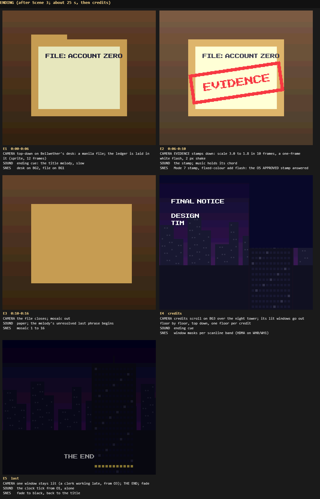

# Final Notice on the Super Nintendo — the cutscenes

*Generated from the knowledge base; edit through `kb_update`, not here.*

*`kb_get snes-cutscenes-introduction` · version 1*

Tim, 08:15 EDT 2026-09-15: *"we also need dedicates SNES cutscene research and designs"*. Part 1 is
what the best SNES games did between play, with a source for every claim; anything we could not
confirm is marked *unverified* and is our reading, not a quote. Part 2 is Final Notice's scenes as
frame-by-frame boards at 256x224. Part 3 is the cards that build them under epic **1898**.

The words stay those of `src/story/script.mjs`. What this adds is staging: camera, acting, effects,
cues and timing. HUD and menu design is card 1975's and title-screen research is card 1978's; the
title logo zoom is only named here where the opening hands over to it.

## Part 1 — how the SNES told stories between play

### In-engine acting: the game's own sprites on the game's own maps

*`kb_get snes-cutscenes-in-engine-acting-the-game-s-own-sprites-on-the` · version 2*

**Final Fantasy VI (Square, 1994), the opera.** The best-known SNES scene is not a cutscene you watch:
the player walks Celes around Draco's sprite "as the music swells", picks the right lyric from memory
of the script, and carries roses to the balcony, so "nailing the performance results in a blissful
synchronization between scripted sequence and player control". Draco's aria first "acts as a tutorial
of sorts" before the player takes Maria's part. The pixel art's limits help: the reader fills the
gaps, and circles walked round a sprite read as a tango [1]. The sprites themselves are the everyday
field sprites, one static frame for Celes facing down reused for her chained pose [2]. Afterwards the
scene turns straight into a timed rafters run and a boss fight [2].

*Takes:* staging with the play sprites instead of new art; the music carries the emotion; a scene
can end by handing the pad over mid-tension.

**Chrono Trigger (Square, 1995).** Its designers built "Active Time Event Logic", "where you can move
your character around during scenes, even when an NPC is talking to you", and battles happen on the
field map rather than a separate screen, with the programmer fighting to load them "without
slow-downs or a brief, black loading screen" [3]. The anime films came only with the 1999 PlayStation
port and play *before* the in-engine version of the same event, which is still shown [4][5].

*Takes:* no black cut between scene and play; the stage's own room is the scene's set.

**EarthBound (Ape/HAL, 1994/95).** Scenes are acted by the overworld sprites with dedicated frames
(Ness and Paula jump at the naming screen; Jeff jumps the boarding school fence) [6]. The sepia-tinted
flashbacks and the photographer's snapshots are *from memory, unverified* here.

### Wordless and near-wordless openings

*`kb_get snes-cutscenes-wordless-and-near-wordless-openings` · version 2*

**Super Metroid (Nintendo R&D1/Intelligent Systems, 1994).** Backstory is a few white-on-black
screens read in "a flat, monotone voice"; Samus's log is typed with keyboard sounds; the music "seems
to rise and fall" with the narration, then stops dead for "CERES STATION IS UNDER ATTACK!!" and the
player walks the dark station among dead scientists to an unwinnable Ridley and a 60-second escape
[7]. The whole game has under 100 words of text and the eleven-word spoken line is its only dialogue
[8][9].

*Takes:* a silence before the hit; the environment tells the crime (the bodies, the broken jar); give
the pad back within a minute.

**Super Castlevania IV (Konami, 1991).** One of the first SNES showcases for layering and Mode 7 [10];
its tone came from "dark, earthy colors; ominous, almost subliminal sound effects" and a sense of
"impending doom" (Entertainment Weekly), and director Masahiro Ueno was proud of how sound and music
built the atmosphere [11]. The opening's exact Mode 7 staging (Simon walking to the gates) is
*unverified* in text sources; watch it before copying it.

*Takes:* mood from low ambient sound more than from words; Mode 7 as a rare set piece.

**Terranigma (Quintet, Japan October 1995).** The prologue is a slow text crawl about a planet with two
souls, Lightside and Darkside [12], opening on "Origins": solo clarinet against a ticking clock,
building to strings and choir [13]. Mode 7 maps and graphical effects were praised [14].

*Takes:* a ticking pulse under a few typed lines is enough for an opening; the clock is our office.

### Full-screen illustrated scenes

*`kb_get snes-cutscenes-full-screen-illustrated-scenes` · version 2*

**Flashback (Delphine, 1992; SNES 1993).** Hand-drawn backdrops and rotoscoped play animation, from
filming a man and drawing over the frames — "more than 1,000 [sprites] for the main character
himself" (Paul Cuisset); the cutscenes themselves were built frame by frame from flat polygons
[15][16]. North American SNES boxes carried a Marvel comic to explain the story [16].

*Takes:* realistic, grounded motion reads as serious; but full-screen polygon film is slow on a
Super FX-less SNES, so we use it for one short shot at most.

**Tales of Phantasia (Namco/Wolf Team, Japan 1995).** The intro sings: a vocal track that could never
fit the SPC700's 64 KB was cut into tiny samples swapped into sound RAM on the fly by a custom driver
[17][18].

*Takes:* one sampled voice line per boss is feasible if it is short; a sung intro is not our scope.

**Street Fighter Alpha 2 (Capcom, SNES 1996).** Its large portraits and endings survived a 32 Mbit
cartridge because the S-DD1 chip decompresses graphics as the game asks for them [19][20]; "a couple
bits are removed or altered from character endings" [21].

*Takes:* big illustrated portraits cost ROM; we keep one 64x96 portrait per speaker, as the cinema
already does, and no special chip.

### Brawler story beats

*`kb_get snes-cutscenes-brawler-story-beats` · version 2*

**Final Fight (Capcom, SNES 1991).** A short opening: Haggar takes a call from Mad Gear, who have
kidnapped Jessica to make him let them run the city; then straight to the streets [22][23].

*Takes:* the whole premise in one phone call and one picture, then play.

**Batman Returns (Konami, SNES 1993).** Cutscenes between stages from the film [24][25] that "won't
make a lot of sense unless you've seen the movie" [25]; large sprites and "dark, moody colors" [25]; a
skip that needed Start on pad 1, A+B on pad 2 and Select [26]; and a Mode 7 Batmobile stage as a
change of pace [25].

*Takes:* dark palettes suit a grounded story; skipping must be one button, never a code; a scene must
stand alone for someone who did not read the design.

**Donkey Kong Country 2 (Rare, December 1995).** The story is barely a scene: DK captured at the beach,
and a ransom note from Kaptain K. Rool left in his broken chair, read as text [27].

*Takes:* a prop carries the plot — our ledger page, the EVIDENCE file.

### The effects, and what late-1995 hardware allowed

*`kb_get snes-cutscenes-the-effects-and-what-late-1995-hardware-allowed` · version 2*

- **Colour math** adds, subtracts or half-blends the main screen with the sub screen or one fixed
  colour (COLDATA); a colour window limits where it applies; sprites in palettes 0-3 never blend and
  sprites cannot blend with each other. Its uses are shadows, ghost fade-outs, translucent text boxes
  and darkness filters [28]. Because the registers can change per scanline by HDMA, a fixed colour can
  paint a gradient [28][29].
- **Mosaic** samples the top-left pixel of each block, 1x1 to 16x16, per BG layer, applied before
  windows and colour math [30]; it does not touch sprites (*unverified* in [30], standard SNES
  behaviour).
- **Master brightness** (INIDISP) fades in 16 steps; already `brightness()` in `src/snes/fx.mjs`.
- **Mode 7** is one 256-colour affine layer with no BG2 or BG3 beside it, so a Mode 7 shot has sprites
  over it but no text box; the game already spends it on the title zoom, the Scene 2 alarm spin and
  the Great Seal press (`docs/SNES-PLAN.md`).
- **Sound:** 8 voices and 64 KB of sound RAM shared by every sample (`docs/SNES-PLAN.md`), so a scene
  cue is the same bank as play, and a voice line is a short sample.

### What held true across all of them

*`kb_get snes-cutscenes-what-held-true-across-all-of-them` · version 2*

| Lesson | Where it came from | Final Notice rule |
| --- | --- | --- |
| Stage with the play sprites and rooms | FF6, Chrono Trigger, EarthBound | scenes after a boss play in that boss's room, sprites acting, before any portrait |
| Music carries the feeling; stop it for the hit | FF6, Super Metroid | each scene has one cue and one hard silence |
| A prop tells the plot | DKC2, Final Fight's phone | the bill, the ledger page, the EVIDENCE file |
| Short, then give the pad back | Super Metroid, Final Fight | opening under 45 s, a between-stage scene under 60 s |
| Skipping is one button | Batman Returns (the counter-example) | Start skips any scene; A/B/Y turns a page |
| Dark, grounded palettes read as serious | Batman Returns, Castlevania IV, Flashback | no bright sky, no cartoon takes; acting is small: a turn, a pause, a hand |
| Mode 7 is an event, not a style | Castlevania IV, Batman Returns | three uses in the whole game, no more |

## Part 2 — Final Notice's scenes, board by board

*`kb_get snes-cutscenes-final-notice-s-scenes-board-by-board` · version 2*

Every board is drawn at 256x224 by `docs/boards/cutscenes.html`, which paints with the game's own
SNES code: the cinema's backdrops and portraits (`src/snes/cinema.mjs`), the BG3 text box
(`src/snes/text.mjs`, card 1911) and the effect passes (`src/snes/fx.mjs`, card 1909) — mosaic,
brightness, colour math, windows and Mode 7 — so each board is a frame the build can reproduce, not
a painting. People and props are stand-in shapes until the sprite and portrait cards land. Serve the
worktree and open `/docs/boards/cutscenes.html` to read each board's camera, sound and SNES notes;
the contact sheets below are those pages shot.

### The rules every scene follows

*`kb_get snes-cutscenes-the-rules-every-scene-follows` · version 2*

- **Start skips, always.** A, B or Y turns a page. A scene seen once is skipped by Start without
  confirmation; there is no second button.
- **Lengths:** opening 40 s, Scenes 1-3 45-55 s, a boss introduction 4-8 s, ending 25 s plus credits.
  The pad returns on the last frame of a boss introduction, never after a fade.
- **Play first, portraits second.** Scenes 1 and 2 open with the play sprites acting in the room for
  3-4 s before any text box (FF6, Chrono Trigger). Scene 2 has no cut from the fight at all.
- **One cue and one silence per scene.** Cues are the existing names (`title`, `scene`, `boss`,
  `ending`, jingles, effects); each scene stops its music once, just before its hit: the stamp in the
  opening, "What incident?" in Scene 2, the speaker in Scene 3.
- **Props carry the plot.** The bill (47 lifetimes) appears in the opening and again on Bellwether's
  desk; APPROVED stamped in the opening is answered by EVIDENCE stamped in the ending; the clerk
  working late in the opening is the last lit window of the credits.
- **Transitions have meanings.** Mosaic changes place; a hard cut stays inside a conversation;
  brightness fades end a scene; Mode 7 is spent only on the stamp, the alarm spin, the press and the
  EVIDENCE stamp — and a Mode 7 frame never carries a text box (Mode 7 has no BG3).
- **Grounded acting:** turns, pauses, a hand on a button, a tie straightened. No jumps, sweat drops
  or emotes.

### Opening (wordless, before the title)

*`kb_get snes-cutscenes-opening` · version 2*

Night skyline, a clock tick, a tilt up a tower to its one lit floor; the bill printing
LIFETIMES BILLED: 47; APPROVED stamped and the music cut; a lift climbing from B3 to the lobby; doors
parting on two auditors, backlit; the title melody begins and the logo takes over (card 1926's zoom).
It shows who the auditors are (they come up from below) without a word of dialogue.

### Scene 1: the assignment

*`kb_get snes-cutscenes-scene-1-the-assignment` · version 2 · **superseded by** `kb_get final-notice-story`*

### Boss introductions

*`kb_get snes-cutscenes-boss-introductions` · version 2*

Vellum's memo card, FILED stamp and "You're overdue." already exist (card 1931) and the Great Seal's
card exists (card 1932); these boards add the camera pan into the office, Vellum standing from the
desk, the Custodian's shorter slip, and the press lowering by Mode 7 before its card.

### Scene 2: the incident

*`kb_get snes-cutscenes-scene-2-the-incident` · version 2 · **superseded by** `kb_get final-notice-story`*

### Scene 3: original documents

*`kb_get snes-cutscenes-scene-3-original-documents` · version 2 · **superseded by** `kb_get final-notice-story`*

### Ending

*`kb_get snes-cutscenes-ending` · version 2*

## Part 3 — the cards that build it

*`kb_get snes-cutscenes-the-cards-that-build-it` · version 1*

Filed under epic 1898, each at most 30 minutes, each ending in a shot or strip Tim can see. They
reuse the cinema player (card 1927), text boxes (1911), effects (1909) and layers (1908), and take
the real portraits and backdrops from card 1937 whenever it lands (stand-ins until then).

| Card | What it builds | Waits on |
| --- | --- | --- |
| 2009 opening, part 1 | O1-O4: fade in, tower tilt with parallax, mosaic into the office, the bill feeding with the count | — |
| 2013 opening, part 2 | O5-O8: APPROVED Mode 7 stamp with the music cut, lift indicator, doors window, hand-off to the title; Start skips | 2009 |
| 2010 cinema staging | acting pages (play sprites in a room, no box), per-page silence and cue changes; Scene 1 staged as S1-1 to S1-6 | — |
| 2014 Scene 2 staged | S2-1 from play with the HUD fading, button insert, spin kept, ledger glow, radio page, mosaic to Stage 2 | 2010 |
| 2015 Scene 3 staged | S3-1 silence, the ledger page scroll, the speaker's colour-subtract dim, phone, hard cut | 2010 |
| 2011 boss entrances | B1 pan and stand before Vellum's card; B2 Custodian slip; B3 press lowered by Mode 7 before the Great Seal card | — |
| 2012 SNES ending | E1-E5: file, EVIDENCE Mode 7 stamp and flash, mosaic, credits with the tower's lights out floor by floor, THE END | — |

## Sources

*`kb_get snes-cutscenes-sources` · version 1*

Read in full for this doc: 1, 3, 7, 11, 14, 16, 25, 27, 28. The rest were read as search excerpts
and are cited for the sentence they carried, no more.

1. Nintendo Life, "The Pitch-Perfect Storytelling Of Final Fantasy VI's Opera": https://www.nintendolife.com/features/the-pitch-perfect-storytelling-of-final-fantasy-virs-opera-and-how-the-pixel-remaster-missed-a-note
2. Final Fantasy Wiki, Opera House: https://finalfantasy.fandom.com/wiki/Opera_House
3. Wikipedia, Chrono Trigger: https://en.wikipedia.org/wiki/Chrono_Trigger
4. Chrono Wiki, Full Motion Video: https://www.chronowiki.org/wiki/Full_Motion_Video
5. GameFAQs Q&A, "Do the anime cutscenes replace in-game story scenes?": https://gamefaqs.gamespot.com/ds/950181-chrono-trigger/answers/14723-do-the-anime-cutscenes-replace-in-game-story-scenes
6. The Cutting Room Floor, EarthBound: https://tcrf.net/EarthBound
7. Kotaku, "The Opening Sequence To Super Metroid Is A Masterpiece": https://kotaku.com/the-opening-sequence-to-super-metroid-is-a-masterpiece-1672800828
8. Gameranx, "Super Metroid: How to Tell a Great Story Without Words": https://gameranx.com/features/id/2724/article/super-metroid-how-to-tell-a-great-story-without-words/
9. Hey Poor Player, "Super Metroid – Telling a Story Without a Plot": https://www.heypoorplayer.com/2016/10/09/supermetroidtellingastorywithoutaplot/
10. Tropedia, Super Castlevania IV: https://tropedia.fandom.com/wiki/Super_Castlevania_IV
11. Wikipedia, Super Castlevania IV: https://en.wikipedia.org/wiki/Super_Castlevania_IV
12. GameFAQs, Terranigma trivia and quotes: https://gamefaqs.gamespot.com/snes/588784-terranigma/trivia
13. Steemit, "The Quintet Quintet: Soundtrack Review: Terranigma": https://steemit.com/review/@terry93d/the-quintet-quintet-or-soundtrack-review-terranigma
14. Wikipedia, Terranigma: https://en.wikipedia.org/wiki/Terranigma
15. Curious Arcade, "Facts About Flashback (1992)": https://curiousarcade.medium.com/facts-about-flashback-1992-the-godfather-of-cinematic-platforming-852c8d04a4bd
16. Wikipedia, Flashback (1992 video game): https://en.wikipedia.org/wiki/Flashback_(1992_video_game)
17. NeoGAF, "How was the intro song to Tales of Phantasia for SFC made?": https://www.neogaf.com/threads/how-was-the-intro-song-to-tales-of-phantasia-for-sfc-made.662437/
18. Wikipedia, Tales of Phantasia: https://en.wikipedia.org/wiki/Tales_of_Phantasia
19. gufranco/snes-street-fighter-alpha-2-nochip (GitHub): https://github.com/gufranco/snes-street-fighter-alpha-2-nochip
20. SNES Central, S-DD1: https://snescentral.com/chips.php?chiptype=S-DD1
21. GameFAQs review, Street Fighter Alpha 2 (SNES): https://gamefaqs.gamespot.com/snes/588699-street-fighter-alpha-2/reviews/170642
22. GameFAQs review, Final Fight (SNES): https://gamefaqs.gamespot.com/snes/588332-final-fight/reviews/168172
23. Street Fighter Wiki, Final Fight: https://streetfighter.fandom.com/wiki/Final_Fight
24. Wikipedia, Batman Returns (SNES video game): https://en.wikipedia.org/wiki/Batman_Returns_(SNES_video_game)
25. Hardcore Gaming 101, Batman Returns (SNES): http://www.hardcoregaming101.net/batman-returns-snes/
26. GameFAQs, Batman Returns (SNES) cheats: https://gamefaqs.gamespot.com/snes/563517-batman-returns/cheats
27. Super Mario Wiki, Donkey Kong Country 2: Diddy's Kong Quest: https://www.mariowiki.com/Donkey_Kong_Country_2:_Diddy's_Kong_Quest
28. SNESdev Wiki, Color math: https://snes.nesdev.org/wiki/Color_math
29. nesdoug, "HDMA Examples": https://nesdoug.com/2020/06/14/hdma-examples/
30. pvsneslib wiki, Graphic Visual Effects: https://github.com/alekmaul/pvsneslib/wiki/Graphic-Visual-Effects
