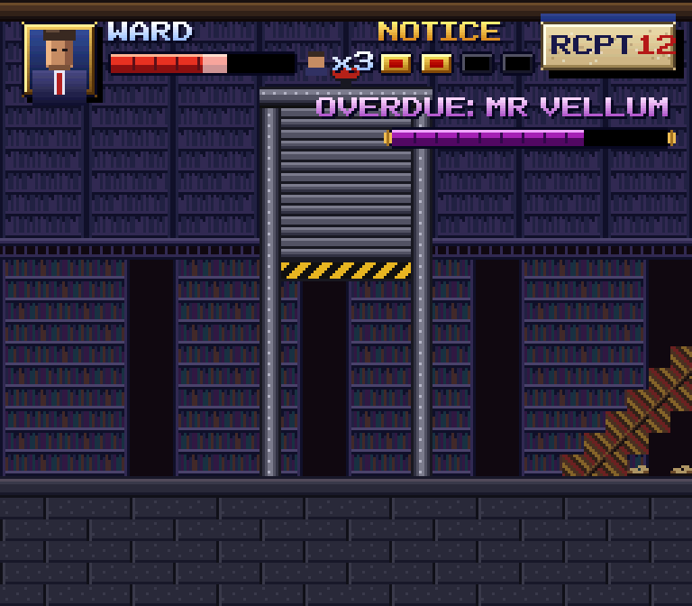
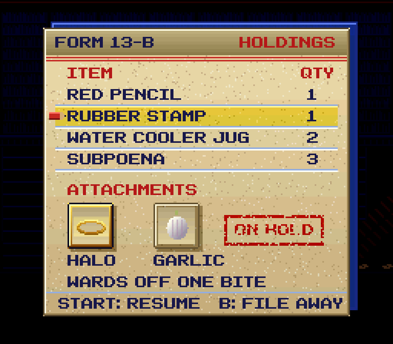
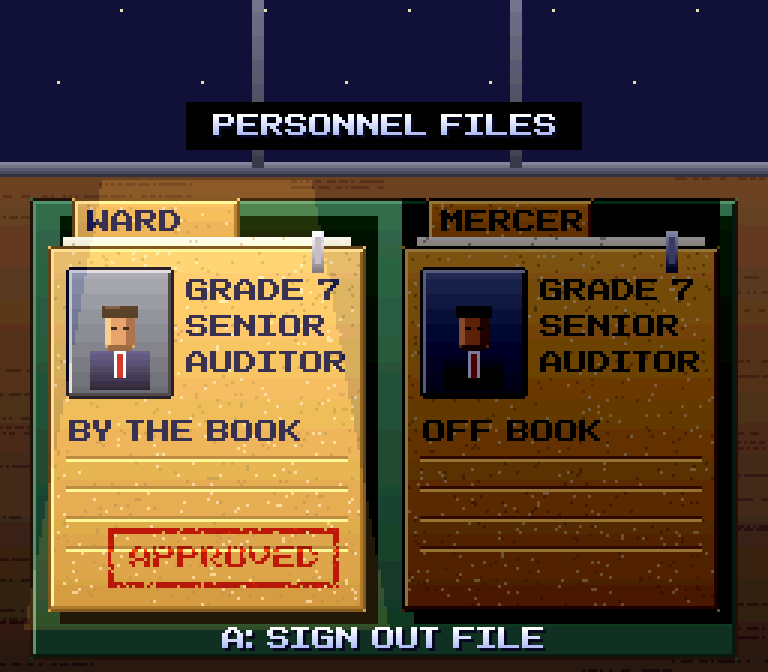

# HUDs and menus on the SNES, and what Final Notice takes

Tim, 08:14 EDT 2026-09-15: *"i want some dedicated research into HUD and Menu design for SNES: what
makes a good HUD? what games had the best HUDs and menus? how unique menus can make a game stand
out, etc"*. This answers those three questions, reviews the HUD we have (`src/snes/hud.mjs`) and the
title and select screens (`src/snes/scenes/`), and ends with a plan and cards.

**How to read the marks.** *(verified: link)* means the linked page was read and says it.
*(search summary: link)* means a search engine's summary of that page said it; the page itself was
not opened. *(from memory, unverified)* means nobody checked. Several fan wikis (Fandom, the Game UI
Database) refuse automatic reading, so games whose menus are famous mostly from play carry more of
the last mark than we would like. Screenshots are referenced by where to find them and are not
committed: the [Game UI Database][gui-db] holds captures of most games below, and the
[Spriters Resource][tsr] holds the menu tiles themselves.

## 1. What makes a good HUD

### Readable at a glance

- **A HUD is read in peripheral vision, between decisions.** A number the player has to stop and
  read costs a moment of play. Bars and pips beat digits for anything the player judges by
  proportion (health); digits win only where exact counts matter (ammo, money).
  *(from memory, unverified: a common HUD guideline, e.g. [Sunstrike Studios][sunstrike])*
- **Shape before colour.** A full segment and an empty one must differ in brightness, not only in
  hue, or they read the same on a small CRT and to colour-blind players *(from memory, unverified)*.
- **One corner per owner.** Brawlers put each player's portrait, name and bar in their own corner
  (Final Fight, Street Fighter), so the eye knows where to look before it knows what it sees
  *(from memory, unverified)*.

### Placement and screen real estate

- **The SNES screen is small: 256x224, and a CRT hides some of the edge.** Nintendo's own guidance
  kept vital text inside a safe area of roughly 8 px either side and more top and bottom
  *(from memory, unverified)*. Our HUD's 8 px inset matches that.
- **Strip or overlay.** Super Metroid and A Link to the Past give the HUD a band at the top the
  playfield never enters; Donkey Kong Country and Street Fighter Alpha 2 draw straight over play.
  A strip costs 16-32 lines of a 224-line screen but never fights the art; an overlay needs
  outlines and shadows to survive a busy background *(from memory, unverified)*.
- **Bosses get their own line.** Final Fight pops an enemy's name and life bar up the moment you
  hit him, and bosses and big goons show a bar that changes colour as it is used up rather than
  one that simply shrinks *(search summary: [The Cutting Room Floor][ff-tcrf])*.

### What to show, what to hide, and when

- **Show what changes a decision now.** Super Metroid's HUD is one line: energy, the reserve tanks,
  missile, super missile and power bomb counts, grapple and X-ray, and a minimap; the weapon you
  have armed is highlighted in place, with Select cycling it, so arming never leaves play
  *(from memory, unverified)*.
- **Counters that appear only on change.** Donkey Kong Country shows nothing over play; the banana
  count and the lives balloon slide in when you pick one up and leave a moment later
  *(from memory, unverified; the Game UI Database lists DKC's "collection counters" but would not
  load: [GUI DB, DKC][gui-dkc])*. The effect is a clean screen that still answers "how many?" at
  the only moment the player asks it.
- **The HUD is feedback, not a scoreboard.** EarthBound's rolling HP meter is the strongest example:
  damage spins the numbers down like a car odometer instead of setting them, so a mortal blow
  leaves time to heal or win before the counter reaches zero; a developer compared it to "those
  odometers in cars" *(search summary: [EarthBound Wiki, Rolling Meter][eb-roll]; who said it was
  not checked)*. The HUD became a mechanic.

### Feedback and animation

- **Animate the change, not the idle.** A bar that drains over a few frames shows how much was
  lost; a pip that flashes before it empties warns. An idle HUD that bobs or pulses competes with
  play *(from memory, unverified)*.
- **Super Mario RPG's timed hits live in the action, not a panel.** Pressing a button just before
  a blow lands raises damage by 50% for "close" and doubles it for perfect timing; the original
  SNES release gave **no on-screen cue**, and the 2023 remake added a "!" over the character
  *(search summary: [Super Mario Wiki, Action Command][smrpg-wiki], [Nintendo][smrpg-nin]; the
  remake detail from [Gamerant][smrpg-gr])*. The lesson cuts both ways: the hidden window rewarded
  watching the animation, and it hid a core mechanic from many players.
- **Street Fighter Alpha 2's super gauge is levelled.** Three sections, Level 1, 2 and MAX, so the
  player reads "can I super?" as a count of full segments; a custom combo runs a separate timer bar
  at the bottom *(search summary: [Street Fighter Wiki, Super Combo Gauge][sfa-gauge])*. Alpha 2's
  life bars are thinner and longer than Street Fighter II's *(search summary: [SF Wiki][sfa2-wiki])*.

### Colour and contrast on busy backgrounds

- **A dark edge around light marks.** One pixel of near-black under every glyph and bar is what
  keeps a white number legible over a sky, a lit floor and a dark corridor alike
  *(from memory, unverified)*. Our BG3 font already draws its shadow in colour 1.
- **Colour means one thing.** Health red, meter gold, boss purple (our `HUD_COLOURS`) is right as
  long as nothing else on screen uses those hues for UI.

### How the hardware shaped all of this

- **Mode 1 is the HUD mode.** BG1 and BG2 carry 16-colour tiles and BG3 carries **4 colours** (2
  bits a pixel); setting the **BG3 priority bit** in `BGMODE` ($2105, bit 3) lifts BG3 above every
  other layer and sprite priority, which is why so many SNES HUDs and text boxes are four-colour
  tiles on BG3 *(verified: [SNESdev PPU registers][sd-ppu]; our [SNES-CLASSICS][classics])*. Four
  colours is transparent, shadow, frame and text: exactly our `BG3_PALETTE`.
- **Windows cut the layers.** `W12SEL`/`W34SEL` and the two window edge pairs `WH0-WH3` mask
  layers or colour math inside a rectangle, and HDMA can move those edges line by line
  *(verified: [SNESdev PPU registers][sd-ppu])*. That is how a text box darkens only what is behind
  it, and how Secret of Mana-style menus can open as a growing shape without redrawing tiles
  *(from memory, unverified for Mana specifically)*.
- **Colour math is one add or subtract, optionally halved.** A translucent menu panel is "subtract
  a fixed colour inside the window" *(verified: [SNESdev PPU registers][sd-ppu], [SNESdev colour
  math][sd-cm])*. It costs no palette slots, so period games used it for dimming the field under a
  pause screen.
- **Master brightness is 0-15 for the whole screen**, not per layer *(verified: [SNESdev PPU
  registers][sd-ppu])*. Our `hudBrightness` fades the HUD 15 to 0; on hardware that would dim the
  game too, so the real-console way is to fade the BG3 palette or to window BG3 off. The browser
  build can keep its fade, but the mockups below assume a palette fade.
- **Sprites cost scanline budget.** 32 sprites a line *(verified: [SNESdev sprites][sd-sprites])*:
  a HUD made of sprites (portrait, icons) eats from the same budget as the enemies on that line, so
  period HUDs are tiles wherever they can be.

## 2. The SNES games with the best HUDs and menus

Where to see each: search the game on the [Game UI Database][gui-db] (captures of HUD, pause and
menus) or [MobyGames][moby] screenshots.

| Game | What it did well | What it did badly |
| --- | --- | --- |
| **Secret of Mana** (1993) | The ring menu: one button pauses play and puts items, weapons and magic in a ring around the character, spun left and right; designed by Kazuko Shibuya so co-op players could act without nested sub-menus *(search summary: [Berkeley Historical Society][som-bhs], [Wikipedia][som-wp]; ring-as-trope: [TV Tropes][tvt-ring])*. The menu lives where the player already looks. | A love-it-or-hate-it design *(search summary: [Berkeley Historical Society][som-bhs])*: the ring shows few items at once and deep inventories become spinning. |
| **Chrono Trigger** (1995) | Battles happen on the field map, no transition to a battle screen *(from memory, unverified)*; the window at the bottom shows each hero's HP, MP and an ATB gauge, and Active vs Wait decides whether time runs while you browse techs *(search summary: [StrategyWiki][ct-sw], [GameFAQs][ct-faq])*. Combined Dual and Triple Techs appear in the tech list only when the partners are present *(search summary: [StrategyWiki][ct-sw])*. The 2018 PC port's redrawn battle UI was so disliked that a patch restored the SNES look *([PC Gamer][ct-pcg], title only; body would not load)*. | Tech lists get long; the menu is plain blue windows, fine but anonymous. |
| **EarthBound** (1995) | Window "flavours" (Plain, Mint, Strawberry, Banana, Peanut) recolour every window from the same tiles; the palette is the whole trick *(search summary: [Starmen.net PK Hack][eb-flav])*. The rolling HP meter turns the HUD into the tension of a fight *(search summary: [Rolling Meter][eb-roll])*. The words carry the character: "Who are you talking to?" when you talk to nobody *(verified: [With a Terrible Fate][eb-wtf])*. | Deep, slow item management (one inventory per character, selling one item at a time) *(from memory, unverified)*. |
| **Super Metroid** (1994) | One-line HUD, weapon arming in place, a minimap that fills as you explore, a pause screen that is a full map plus a separate equipment screen, both in the game's dark tech palette *(from memory, unverified; map background: [Wikitroid, Map][mt-map] would not load)*. | The equipment screen's toggles are fiddly; the map does not mark items you saw but did not reach *(from memory, unverified)*. |
| **Final Fantasy VI** (1994) | Main menu with party portraits left and commands right; Config lets the player pick window colours by RGB sliders, battle mode and cursor memory *(search summary: [Final Fantasy Wiki, Config][ff6-config])*. Customising the window is personality at no art cost. | The battle screen stacks names, HP and ATB bars in a text-dense window; late-game menus sprawl (Espers, Lores, Rages) *(from memory, unverified)*. |
| **Super Mario RPG** (1996) | Button-shaped command diamond matching the pad's A/B/X/Y layout *(from memory, unverified)*; timed hits move the "HUD" into the characters' animation *(search summary: [Super Mario Wiki][smrpg-wiki])*. | No cue for the timing window on SNES *(search summary: [Gamerant][smrpg-gr])*. |
| **A Link to the Past** (1991) | A top strip with magic meter, rupees, bombs, arrows, keys and hearts; Start opens a subscreen over the paused game with the item grid and the selected item's name *(search summary: [Zelda Wiki, Subscreen][z-sub])*; a separate map with the dungeon floor list *(from memory, unverified)*. | The strip is always on even in calm overworld walking *(from memory, unverified)*. |
| **Donkey Kong Country 2** (1995) | Carries DKC's hide-until-needed counters (bananas, lives balloons, coins) that slide in on pickup *(from memory, unverified)*; lives come from 100 bananas and balloons *(search summary: [DK Wiki, Extra Life Balloon][dkc-balloon])*. | When nothing shows, a player who wants the count must go and collect something *(from memory, unverified)*. |
| **Street Fighter Alpha 2** (1996 SNES) | Long thin life bars across the top, a three-level super gauge along the bottom, a round timer at the centre top *(search summary: [SF Wiki][sfa-gauge], [SF Wiki, Alpha 2][sfa2-wiki])*. Everything symmetrical, so both players read their side the same way. | Dense text pops for combos and first attack *(from memory, unverified)*. |
| **Final Fight** (1991 SNES) | Player portrait, name, score and bar top left; the enemy you hit gets his name and bar beside yours, so the HUD names the foe *(search summary: [TCRF][ff-tcrf])*. Bosses' bars change colour rather than running out *(search summary: [TCRF][ff-tcrf])*. | Only the last foe hit is shown; a crowd leaves you guessing *(from memory, unverified)*. |

**Tim's era targets** (from `docs/SNES-CLASSICS.md`):

- **Super Castlevania IV** (1991): a top strip of player and enemy bars, hearts, time and score
  *(from memory, unverified)*. Good: the enemy bar across from yours makes a boss a duel. Weak: the
  strip is always on.
- **Sunset Riders** (SNES 1993): the wanted poster before each boss is a menu doing story work,
  a name and a bounty on a period prop *(from memory for the poster art; the lesson is S3 in
  [SNES-CLASSICS][classics])*.
- **TMNT IV: Turtles in Time** (SNES 1992): per-turtle portraits and pip-life in their own corners
  *(from memory, unverified)*.
- **Donkey Kong Country** (1994): as DKC2 above.

## 3. How distinctive menus make a game stand out

- **Diegetic: the menu is a thing in the world.** Dead Space puts health on the suit's spine and
  the inventory in a hologram in front of Isaac, and the game never leaves its world
  *(search summary: [iABDI][ds-iabdi], [Wayline][wayline])*. The SNES versions are smaller:
  Sunset Riders' wanted posters, EarthBound's phone calls to Dad to save *(from memory,
  unverified)*.
- **Themed, not diegetic: the menu is in the world's style.** Persona 5's menus are "full of
  personality", a style that is the game's voice rather than an object inside it
  *(search summary: [Jaiwanth, Medium][ds-medium], [Flywheel][flywheel])*. On the SNES this is
  EarthBound's flavours and FF6's window colours: the palette and the words, which cost nothing.
- **Sound gives menus a body.** A distinct cursor tick, a confirm and a cancel teach the player
  what each press did with eyes elsewhere. EarthBound's menu blips and Chrono Trigger's cursor
  chirp are recognisable on their own *(from memory, unverified)*. A menu song is a strong signal:
  Secret of Mana and FF6 keep the field music under menus, which keeps momentum *(from memory,
  unverified)*.
- **Transitions are where a theme shows most cheaply.** Mosaic, a window edge swept by HDMA, a
  brightness dip: a few frames that tell you which world the menu belongs to *(the hardware:
  [SNESdev PPU registers][sd-ppu])*.
- **Character is words.** EarthBound's check text and status names ("homesick") give the menus a
  voice at the cost of a string table *(verified: [With a Terrible Fate][eb-wtf])*.
- **How much is too much.** The theme may slow **nothing the player repeats**. A stamp slam that
  plays every time you open pause becomes a toll by the tenth pause; play it once, or let a second
  press skip it. Legibility beats theme: a ledger grid that makes a menu look like a spreadsheet
  must still read in four colours at 256 px. The Chrono Trigger PC port is the cautionary tale
  of redrawing a menu players already loved *([PC Gamer][ct-pcg])*.

## 4. Our current screens against the findings

- **HUD (`src/snes/hud.mjs`)**: right on the big calls. BG3, four colours, an 8 px inset, no strip,
  hide-until-needed after 2.5 s idle, bars for health, segments for the Notice meter, a boss bar
  that appears only for a boss. Gaps: (a) the fade uses master brightness, which on hardware dims
  the whole screen; (b) the HUD fades in and out as a block, where DKC's lesson is per-counter;
  (c) a hit changes the bar instantly, where a short drain or EarthBound-style roll shows the loss;
  (d) nothing themes it to Final Notice: it could be any game's HUD.
- **Title (`src/snes/scenes/title.mjs`)**: the Mode 7 logo zoom over the skyline and PUSH START is
  period-correct. Missing: an options entry, and nothing of the audit theme until select.
- **Select (`src/snes/scenes/select.mjs`)**: the lamp by colour math and the dimmed well are
  exactly the SNES-honest effects section 1 describes. It is a character select, not a personnel
  file: the obvious place for the theme.

## 5. Recommendation for Final Notice

**The rule: the office's paperwork is the interface.** Every menu is a document an auditor would
hold (a form, a ledger page, a personnel file, a receipt), drawn in four ink colours on paper, with
a carbon copy one step behind it. The theme lives in palette, words and a stamp; nothing the player
repeats waits on it (section 3, *how much is too much*).

The mockups are drawn at 256x224 in 15-bit colour with the game's own font, over its own painted
backgrounds (the Archive stage and the title skyline), from `docs/shots/item-1975/mockups.html`
(serve the repo root and open it; `?only=0|1|2` for one).

**SNES, not NES** (Tim, on the first flat draft: *"these menus look like NES style dude, SNES is way
more complex!"*). A flat box of four solid colours is what an NES can do. Every menu and HUD piece
spends the tools only the SNES has (section 1, *How the hardware shaped all of this*):

- **Per-line gradients** on window fills, header bands, lettering and the lamp cone: HDMA
  rewriting the fixed colour or a palette entry each scanline.
- **Colour math** for every soft thing: drop shadows (subtract), the see-through carbon copy (add,
  halved), the dimmed field under pause (subtract, deepening down the screen), the highlighter
  over the chosen row (subtract blue), the worn stamp ink that lets the paper's grain show through
  (subtract cyan), and the unchosen personnel file (subtract).
- **Bevelled frames in three to four shades** with rounded corners, and **shaded 16-colour art**
  (paper grain, brass bezel, halo, garlic, portraits, paper clip) instead of single-colour fills.
- **Bars with a highlight row, a mid and a shadow**, tick marks and a translucent track.

### HUD in play

- **Keep what we have**: BG3, corner layout, hide until needed.
- **Fade per group, not the whole HUD**, the DKC way: the health group shows on a hit or heal, the
  Notice meter on a gain, the enchantment slots on a swap, each for 2.5 s. Fade by stepping the
  BG3 palette toward transparent or windowing the group off, never master brightness.
- **Show the loss**: a hit leaves the lost slice of the bar pale for 20 frames, then it drains.
- **Notice meter segments are stamp boxes**: a red bar stamped into each gold box as it fills.
- **Pickups post a receipt**: a small paper tab (RCPT 12) with its carbon offset slides in top
  right on pickup and leaves; the one piece of the theme in play.
- **The boss is an overdue account**: `OVERDUE: <NAME>` over the boss bar; the bar's colour darkens
  at half, Final Fight's colour-change trick, instead of a separate phase marker.

### Pause and inventory

- **Pause is Form 13-B, Holdings**: a paper window over the field, which is dimmed by colour math
  (subtract, halved) inside a window, so it costs no palette.
- **Items are ledger rows**: name and quantity, pale blue rules, a red pencil tick for the cursor.
- **Enchantments are attachments A and B**, the two slots from the HUD, the held one framed gold.
  Swapping is left and right on the attachments row; the enchantment's name and a one-line
  effect sit under the slots.
- **An ON HOLD stamp** lands once when pause opens (4 frames, a thud) and is then static;
  a second pause within a few seconds skips it.
- **Sound: hold music.** Pause ducks the stage track and plays a looping hold-music arrangement of
  the CorporateWave theme (`docs/THEME.md`), quoted as a fragment (lesson S10). Cursor is a pencil
  tick, confirm a stamp, cancel a paper slide.

### Select

- **Select is two personnel files** on a green desk blotter; the chosen file is lit, the other
  dimmed by colour math, as the current lamp-and-well select already does. The file shows a photo
  (the idle sprite), grade and a one-line temperament (BY THE BOOK, OFF BOOK).
- **Confirm stamps APPROVED** on the chosen file (the one stamp that plays every time; it is the
  choice), then the scene mosaics out as now.

### Title flow

- Keep the Mode 7 logo zoom and PUSH START. After Start, **a short menu on a memo slip**: NEW
  AUDIT, CONTINUE (if a save exists), SETTINGS. Settings borrows FF6: window colour ("paper stock":
  manila, carbon blue, pink copy), text speed, and stereo or mono.
- **Transitions**: title to menu slides the memo up; menu to select is the file drawer
  (a vertical wipe by HDMA window edge); select to play is the existing mosaic.

### What not to do

- No ring menu: two auditors and a short item list do not need one, and a ring hides a list.
- No animated idle HUD, no always-on strip, no stamp on every cursor move.
- No diegetic-only HUD (health on the character's back): the sprites are too small to read it.

### The build, as cards under epic 1898

| Card | What | Waits on |
| --- | --- | --- |
| 1999 | HUD groups fade on their own by palette; the lost slice of the bar shows, then drains; stamp-box Notice meter | 1931 |
| 2003 | Pickup receipt tab; OVERDUE boss label and half-health colour change | 1999 |
| 2000 | Pause as Form 13-B: ledger items, attachments A and B, ON HOLD stamp once | — |
| 2004 | Hold-music pause theme; pencil tick, stamp and paper-slide menu sounds | 2000 |
| 2001 | Select as two personnel files, APPROVED stamp on confirm | — |
| 2002 | Title memo menu: NEW AUDIT, CONTINUE, SETTINGS with paper stock | — |
| 2005 | File-drawer wipe from memo to select; every transition skippable | 2001, 2002 |

## Sources

[gui-db]: https://www.gameuidatabase.com/
[gui-dkc]: https://www.gameuidatabase.com/gameData.php?id=1799
[tsr]: https://www.spriters-resource.com/snes/
[moby]: https://www.mobygames.com/
[sunstrike]: https://sunstrikestudios.com/en/blog/HUD_design_in_games/
[ff-tcrf]: https://tcrf.net/Final_Fight_(SNES)
[eb-roll]: https://earthbound.fandom.com/wiki/Rolling_Meter
[eb-flav]: https://forum.starmen.net/forum/Community/PKHack/Modifying-Earthbound-s-Window-Flavours
[eb-wtf]: https://withaterriblefate.com/2021/07/07/why-earthbounds-flavor-text-tastes-so-good/
[smrpg-wiki]: https://www.mariowiki.com/Action_Command
[smrpg-nin]: https://www.nintendo.com/us/whatsnew/heres-all-you-need-to-know-about-battling-in-super-mario-rpg/
[smrpg-gr]: https://gamerant.com/super-mario-rpg-remake-action-commands-gauge-triple-action/
[sfa-gauge]: https://streetfighter.fandom.com/wiki/Super_Combo_Gauge
[sfa2-wiki]: https://streetfighter.fandom.com/wiki/Street_Fighter_Alpha_2
[sd-ppu]: https://snes.nesdev.org/wiki/PPU_registers
[sd-cm]: https://snes.nesdev.org/wiki/Color_math
[sd-sprites]: https://snes.nesdev.org/wiki/Sprites
[classics]: SNES-CLASSICS.md
[som-bhs]: https://berkeleyhistoricalsociety.org/secret-of-mana-s-co-op-magic/
[som-wp]: https://en.wikipedia.org/wiki/Secret_of_Mana
[tvt-ring]: https://tvtropes.org/pmwiki/pmwiki.php/Main/RingMenu
[ct-sw]: https://strategywiki.org/wiki/Chrono_Trigger/Gameplay
[ct-faq]: https://gamefaqs.gamespot.com/snes/562913-chrono-trigger/answers/354553-whats-the-difference-between-wait-and-active-battle-modes
[ct-pcg]: https://www.pcgamer.com/chrono-trigger-patch-bring-back-old-school-battle-ui-and-character-design/
[mt-map]: https://metroid.fandom.com/wiki/Map
[ff6-config]: https://finalfantasy.fandom.com/wiki/Config
[z-sub]: https://zelda.fandom.com/wiki/Subscreen
[dkc-balloon]: https://donkeykong.fandom.com/wiki/Extra_Life_Balloon
[ds-iabdi]: https://www.iabdi.com/designblog/2022/3/18/h04cs7ub04vkmyfcs3t2krmfey5mc3
[ds-medium]: https://medium.com/@jaiwanthshan/designing-effective-diegetic-ui-lessons-learned-from-dead-spaces-success-and-the-callisto-dbf803639dd6
[wayline]: https://www.wayline.io/blog/diegetic-interfaces-game-design
[flywheel]: https://www.flywheelstrategic.com/thinking/post/flywheel-blog/2022/09/07/what-we-can-learn-from-diegetic-ui-in-gaming
