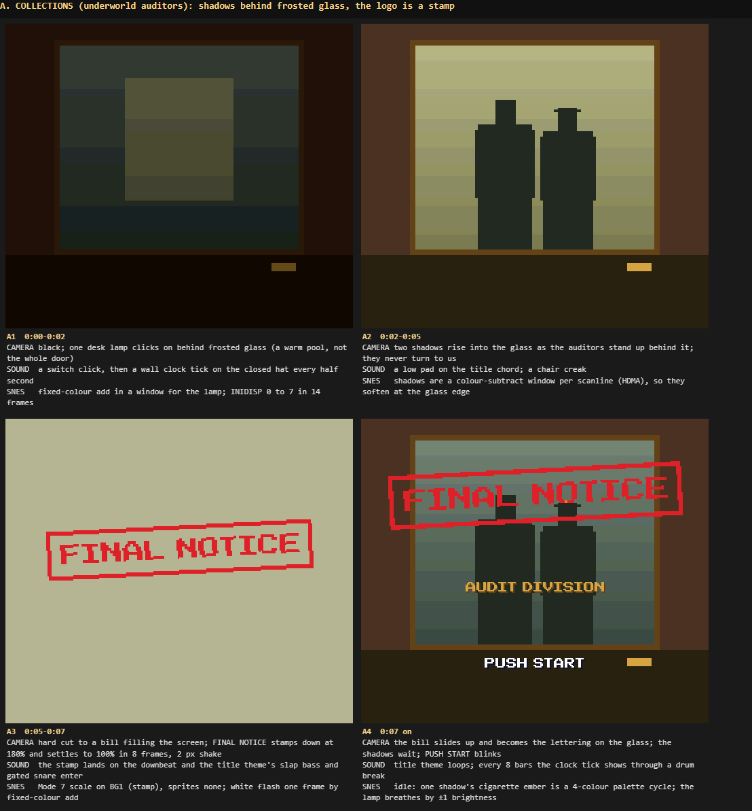
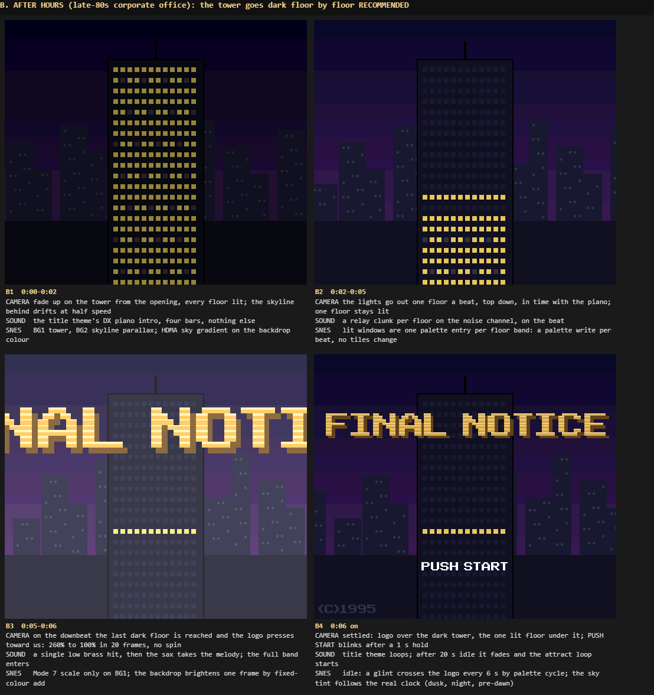
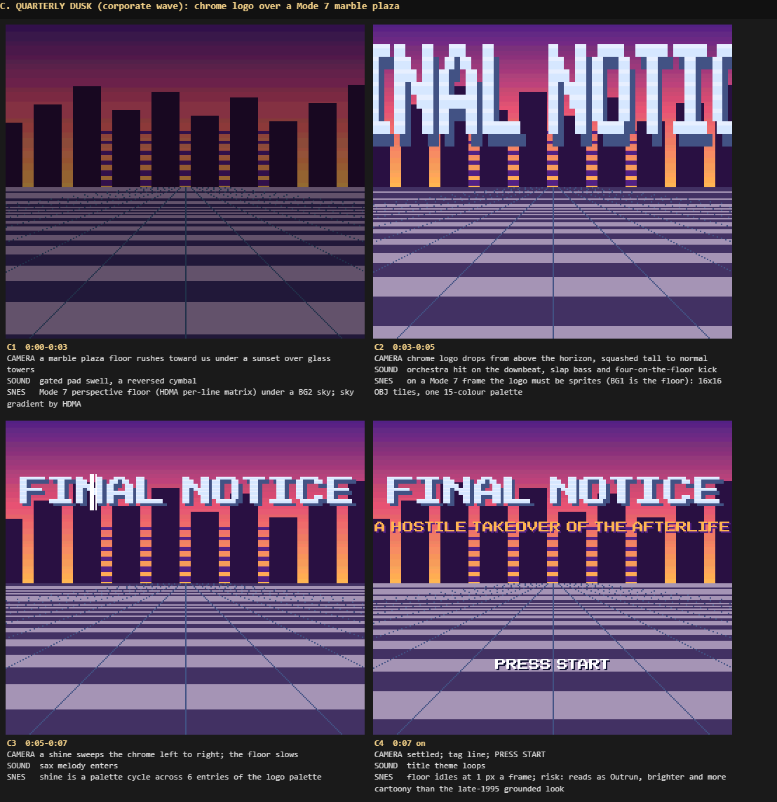

# SNES title screens

*Generated from the knowledge base; edit through `kb_update`, not here.*

## what the best SNES titles did

### The eleven, one at a time

*`kb_get snes-title-screens-the-eleven-one-at-a-time` · version 1*

**Chrono Trigger (Square, 1995).** A pendulum swings past the screen, loses energy and stops in frame,
and only then does the title emerge beside it — the theme of time, told before a word [1]. The sound
is a clock's tick-tock, which "then goes into the opening music/demo" [2]; left idle, the eerie
"A Premonition" plays over a montage of events from the eras, and flows into the main theme [3][4].
The title and the attract highway race are both Mode 7 scenes in the engine [5].

*Takes:* one symbolic object that moves before the logo; a tick as the first sound; the attract loop
is a trailer of places, not a gameplay demo.

**Final Fantasy VI (Square, 1994).** "Flashes of lightning illuminate an ominous, stormy sky,
accompanied by the sinister strains of a church organ" [6]. The organ opening stacks pitches a fourth
apart and the logo arrives with it, lettered in fire against the storm [7]. Then the camera descends
through the exposition, and the credits run over Mode 7-scaled Magitek armour trudging through snow
toward Narshe, staff names above them, under Terra's Theme [6][8].

*Takes:* the first sound is the whole mood (one instrument, no drums); the logo carries a material
(fire) rather than a flat colour; credits can ride over the first in-world image.

**Super Metroid (Nintendo, 1994).** The title plays a whole-tone intro whose ambiguity leaves the
listener uneasy, and cuts between close-ups of the same dead room — two bodies, a broken jar, another
corpse — before the logo [9]; "The last Metroid is in captivity" then leads into the narrated demo
screen [10]. Left idle, it runs attract demos [11]; that they show off movement techniques is
*from memory, unverified*.

*Takes:* dread before spectacle; hard cuts within one room keep it clear; attract demos double as a
tutorial.

**Super Castlevania IV (Konami, 1991).** The title is a crumbling brick wall where insects crawl and
the shadows of bats pass over [12]; the opening proper is a graveyard where lightning shatters
Dracula's stone and a bat flies out [13]. Its tone was "dark, earthy colors; ominous, almost
subliminal sound effects" [14].

*Takes:* texture and small creatures sell the place more than a big effect; shadows (colour math)
are cheaper and scarier than sprites.

**Donkey Kong Country 2 (Rare, 1995).** The game opens with Diddy on the deck of a pirate ship run
aground [15], and the pirate-ship world's music is arranged three times by David Wise [16]. The title
screen's own staging (the ship deck under the logo, the Kongs idling) is *from memory, unverified*;
we did not find a text source describing it. Its predecessor's pre-title scene — Cranky on a
gramophone, DK knocking him aside with a boombox remix — is documented [17].

*Takes:* a pre-rendered look that set a hardware bar (see Part 1's summary); a gag before the title
belongs to a cartoon game, which we are not.

**Street Fighter Alpha 2 (Capcom, SNES 1996).** The SNES port leaned on the S-DD1 decompression chip
for its graphics and still had loading pauses while sound transferred to the SPC700 [18]; a code is
entered at the Capcom logo before the title [19], and the title then offers arcade mode and other
modes [19]. *Unverified:* the attract loop of character portraits and versus screens.

*Takes:* a title that stalls is felt at once; our title must be ready to take Start from frame one.
A code at the publisher logo is a secret players remember.

**Final Fight (Capcom, SNES 1991).** Attract mode flashes "PUSH START" in Japan and "PRESS START"
abroad [20]; leaving the slum/subway demo running seeds a random number that sometimes makes the next
16 games easier [20]. The intro is the Mad Gear call to Haggar (softened for the SNES) [20].

*Takes:* the prompt's two words are a regional choice (ours stays PUSH START, card 1926); an attract
demo is a real run of the engine, so it can be a stage demo with no extra art.

**Terranigma (Quintet, 1995).** The opening "Origins" is a solo clarinet against a ticking clock that
builds to strings and choir before the main theme [21]. The Japanese title builds its name one kanji
at a time [22]. A ranking of SNES titles faults its logo font while calling everything else "epic"
[23].

*Takes:* a tick under one lonely voice is a proven opening; lettering assembled piece by piece is a
reveal that costs no Mode 7; a weak font sinks a strong screen.

**Secret of Mana (Square, 1993).** The whole sequence was drawn first and the music written to it:
Kikuta timed the animation and noted cues like "1:05 birds fly" and "1:22 Square [logo]" over 1:36 [24].
The background was so heavily compressed it took about a minute to decode, so text scrolls and wipes
covered it while the image panned up as it decoded [24]. "Fear of the Heavens" opens on whale song,
an echoing piano and strings, cymbals the only percussion [25][26]; the Japanese title shows the
whole Mana Tree where the international one zooms into its roots [23].

*Takes:* cue sheet first — every visual beat has a frame number in the music; a hardware limit (slow
decode) was turned into a slow reveal; a sound that is not music (whales) makes the place.

**EarthBound (Ape/HAL, 1994/95).** Before the title, a bitcrushed photo of an American main street
under alien lasers, "THE EVIL GIYGAS ATTACKS!", a high tone that falls into pounding drums, like a
1950s B-movie poster [27]. The title screen's own letter-by-letter logo is *from memory, unverified*.

*Takes:* genre pastiche in one image and one caption; the dread comes from sound as much as the
picture.

**Contra III: The Alien Wars (Konami, 1992).** The North American title's entry animation is longer:
"The Alien Wars" slides in from both sides with sound effects [28]. Mode 7 runs through the game
(two overhead stages, a bomber rotating and scaling out of the background) [29][30]. The 1P/2P choice
on the title is *from memory, unverified*.

*Takes:* the subtitle's arrival is its own beat with its own sound; two options is enough of a menu.

### The questions, answered

*`kb_get snes-title-screens-the-questions-answered` · version 1*

**The first five seconds.** The best titles open on *one* thing: a tick (Chrono Trigger, Terranigma),
an organ chord (FF6), a whole-tone drone (Super Metroid), whale song (Mana). The picture is quiet or
dark, and the logo lands on a musical event rather than on a timer [1][6][9][24]. Nothing in the first
seconds explains the controls.

**Attract mode.** Two kinds: a *trailer* of places and moments (Chrono Trigger's montage [3]) or a
*demo* of the engine playing itself (Super Metroid, Final Fight [11][20]). Both return to the title on
any button without replaying the reveal *(standard behaviour; unverified per game)*.

**Selling tone and world.** A single material or object does it: fire and storm (FF6), a pendulum
(Chrono Trigger), rotting brick and bats (Castlevania IV), a dead lab (Super Metroid). None shows the
hero's face on the title.

**Logo and typography within SNES limits.** A BG logo lives in 16-colour palettes on 8x8 tiles; a
logo that scales or rotates by Mode 7 must be the one 256-colour Mode 7 layer, with no BG2 or BG3
beside it (`docs/SNES-CUTSCENES.md`, the effects). The logos that last have a material ramp (FF6's
fire) and a heavy face; a thin or generic font is called out even on an epic screen [23]. Lettering can
also be revealed piece by piece with no scaling at all (Terranigma JP [22], Contra III's subtitle [28]).

**Mode 7, colour math, parallax, palettes.** Mode 7 is spent once, on the reveal (Chrono Trigger,
Contra III [5][28]); colour math makes shadows and light (Castlevania IV's bat shadows [12]); parallax
and a slow pan give depth while something else decodes or waits (Mana [24]); palette cycling covers
glints, embers and lamps at no tile cost.

**Music and sound.** Composed to the picture, with cue times (Mana [24]); the first sound is not the
melody but a texture that the melody grows out of (tick, organ, whales, drone). A sound effect marks
each visual beat (Contra III's subtitle [28]).

**PUSH START and the transition.** The prompt appears only after the logo settles and holds; the
wording is regional (Final Fight [20]). Pressing it must feel instant — SFA2's loading pauses are the
counter-example [18]. Our hand-over is already written: Start slides the memo menu up (card 2002),
then the file-drawer wipe to select (card 2005).

**Menu options on the title.** Two or three at most: Contra III's players, SFA2's modes [19]. Ours are
card 1975's NEW AUDIT, CONTINUE (only with a save) and SETTINGS, shown only after Start (hide until
needed).

**Memorable touches.** A secret at the publisher logo (SFA2's code [19]); a hidden consequence of
idling (Final Fight's easier games [20]); small idle life (Castlevania IV's insects [12], Mana's
flamingos, added on an artist's whim [24]). A real-time-clock change is *not* documented for any of
the eleven — the SNES has no clock — so a sky that follows the player's clock is our own browser-era
touch, kept small.

## three title concepts for Final Notice

*`kb_get snes-title-screens-three-title-concepts-for-final-notice` · version 1*

Every board is drawn at 256x224 by `docs/boards/title.html` with the game's own SNES code
(`src/snes/fx.mjs` for brightness, colour math, windows and Mode 7; `src/snes/text.mjs` for type), so
each board is a frame the build can reproduce. Serve the worktree and open `/docs/boards/title.html`.
All three sit on the title theme already on samples (`docs/THEME.md`: sax lead, DX piano, pads, slap
bass, gated drums) and hand over to the memo menu on Start.

### A. Collections — the underworld auditors

*`kb_get snes-title-screens-a-collections-the-underworld-auditors` · version 1*

A lamp clicks on behind frosted glass; two shadows stand up behind it; hard cut to a bill and FINAL
NOTICE stamped in red on the downbeat; the bill becomes the lettering on the door, AUDIT DIVISION
under it, the shadows waiting. Sound: switch click, clock tick, low pad, then the band enters on the
stamp. SNES: fixed-colour add for the lamp, colour-subtract shadows by HDMA window, Mode 7 stamp,
a palette-cycled cigarette ember. *Against it:* the opening already spends a Mode 7 stamp (APPROVED,
board O5), so a second stamp seconds later cheapens both.

### B. After Hours — the late-80s corporate office (recommended)

*`kb_get snes-title-screens-b-after-hours-the-late-80s-corporate-office` · version 1*

The opening ends on the tower (board O8); the title picks it up with every floor lit. Through the
piano's four-bar intro the lights go out floor by floor, one a beat, top down, with a relay clunk on
each; one floor stays lit. On the downbeat the brass logo presses toward us by Mode 7 scale (no spin),
a brass hit and the sax take the melody, and PUSH START appears after a one-second hold. Idle: a glint
crosses the logo every 6 s; the sky follows the player's clock; after 20 s the attract loop starts.
SNES: tower BG1, skyline BG2 parallax, HDMA sky gradient, lights as one palette entry per floor band,
Mode 7 scale, one-frame fixed-colour flash.

### C. Quarterly Dusk — corporate wave

*`kb_get snes-title-screens-c-quarterly-dusk-corporate-wave` · version 1*

A Mode 7 marble plaza rushes toward us under a sunset over glass towers; a chrome logo drops in with an
orchestra hit; a shine sweeps it; a tag line and PRESS START. SNES: per-line Mode 7 floor, HDMA sky,
chrome logo as sprites (BG1 is the floor), a palette-cycled shine. *Against it:* it reads as Outrun —
brighter and more cartoony than the grounded late-1995 look the game is aiming for — and its logo would
have to be OBJ tiles, which caps its size.

## the pick, and the cards that build it

*`kb_get snes-title-screens-the-pick-and-the-cards-that-build-it` · version 1*

**Pick: B, After Hours.** It is the only concept that uses the Part 1 lessons without fighting the
rest of the game: one object tells the story (the building goes home, one floor doesn't — who is still
working?), the logo lands on a musical event, Mode 7 is spent once, and it continues the opening's last
shot instead of repeating its stamp. It keeps what card 1926 built (the skyline, the Mode 7 logo,
PUSH START) and changes the parts that were generic: a logo that spun in on a timer, a prompt that only
blinked. Rejected: A (a second stamp after the opening's), C (off-tone for a grounded game).

The rules the build follows:

- **Start is taken from frame one.** A press during the reveal jumps to the settled title; a second
  press opens the memo menu. Nothing loads.
- **Cue sheet first.** Every beat above has a frame in the title song: the floors on the piano's
  beats, the logo on the downbeat of bar 5. Take the tempo from the song, never a timer.
- **Mode 7 once.** The logo press is the title's only affine effect.
- **Hide until needed.** PUSH START is the only text; no copyright line in the build (the board's is
  a period prop), no hint of the secret.
- **Prompt pulses, not blinks** (card 2020's ask): brightness 15 to 9 and back over one second.

| Card | What it builds | Waits on |
| --- | --- | --- |
| 2021 | B1-B2: tower all lit, lights out one floor a beat through the piano intro, one floor left, relay clunks | — |
| 2022 | B3-B4: brass logo lettering, Mode 7 scale-only press on the downbeat, flash and brass hit, glint cycle; art judge | 2021 |
| 2024 | Prompt pulse after a 1 s hold; Start during the reveal skips to settled; Start confirm sound and a 6-frame hold into the memo menu (2002); 20 s idle to the attract loop (opening, then a stage demo) and back to the settled title | 2022 |
| 2023 | Sky gradient by the player's clock (dusk, night, pre-dawn); the clerk in the lit floor moves; PAST DUE at midnight | 2021 |

Card 2020 then joins the opening (2009, 2013) to this title and posts the clip.
